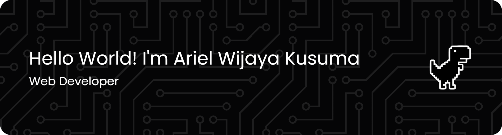

<!-- ## Hello World! I'm Ariel Wijaya Kusuma 👋 -->

<!--
**Naksuuuu/Naksuuuu** is a ✨ _special_ ✨ repository because its `README.md` (this file) appears on your GitHub profile.

Here are some ideas to get you started:

- 🔭 I’m currently working on ...
- 🌱 I’m currently learning ...
- 👯 I’m looking to collaborate on ...
- 🤔 I’m looking for help with ...
- 💬 Ask me about ...
- 📫 How to reach me: ...
- 😄 Pronouns: ...
- ⚡ Fun fact: ...
-->

### Hi there 👋, I'm Ariel Wijaya

- 🌱 I’m currently learning **Next.js** Framework
- 🎓 I'm studying at **Pasundan University**
- 💼 Open for **freelance projects** and collaborations
- 💬 Ask me about **Web Development**, **React**, or **Next.js**
- ⚡ Fun fact: I enjoy building clean, functional, and creative websites!

### 🧠 Skills & Tools

&nbsp;
&nbsp;
&nbsp;
&nbsp;
&nbsp;
&nbsp;\
&nbsp;
&nbsp;
&nbsp;
&nbsp;\
&nbsp;

  
  

### 🌐 Connect with me

  
  
  

  

